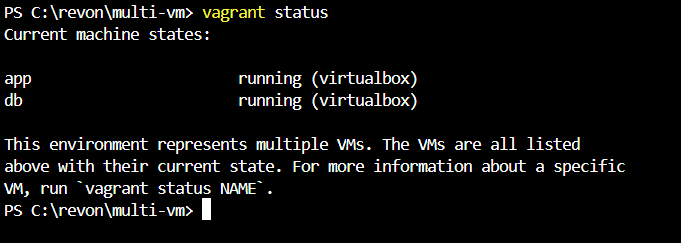

# Setting Up a Multi-VM Network with Internal Connectivity Using Vagrant and VirtualBox

## Project Overview:

In this project, you’ll configure multiple virtual machines (VMs) using Vagrant and VirtualBox, establish internal connectivity, and enable communication between them using a private network. This setup is ideal for simulating distributed systems, multi-tier applications, or isolated environments.

---

## Prerequisites:

Before starting, ensure your system meets the following requirements:

1. **Sufficient Host Machine Resources:**
At least 8 GB of RAM and multiple CPU cores to support multiple VMs.

---

## Step-by-Step Implementation:

### Step 1 - Initialize the Project

- Organize the project files in a dedicated folder:

   ```bash
   mkdir multi-vm
   cd multi-vm
   ```

- Generate a default `Vagrantfile`:

   ```bash
   vagrant init
   ```

---

### Step 2 - Configure the Vagrantfile

- Open the `Vagrantfile` in your preferred text editor:

   ```bash
   nano Vagrantfile
   ```
   Or:
   ```bash
   code Vagrantfile
   ```

- Replace the default content with the following configuration:

   ```ruby
   Vagrant.configure("2") do |config|
     # VM 1: Application Server
     config.vm.define "app" do |app|
       app.vm.box = "bento/ubuntu-22.04"
       app.vm.hostname = "app.local"
       app.vm.network "private_network", ip: "192.168.56.10"
       app.vm.provider "virtualbox" do |vb|
         vb.memory = "1024"
         vb.cpus = 1
       end
     end

     # VM 2: Database Server
     config.vm.define "db" do |db|
       db.vm.box = "bento/ubuntu-22.04"
       db.vm.hostname = "db.local"
       db.vm.network "private_network", ip: "192.168.56.11"
       db.vm.provider "virtualbox" do |vb|
         vb.memory = "1024"
         vb.cpus = 1
       end
     end
   end
   ```

**Key Configuration Highlights:**

**VM Definitions:**
  - app: Acts as the application server.
  - db: Serves as the database server.

**Private Network:** Each VM has a private IP for internal communication.

**Resources:** Allocates 1 GB of RAM and 1 CPU core per VM.

---

### Step 3 - Start the Virtual Machines

- Bring Up the VMs:

   ```bash
   vagrant up
   ```

- Verify the VMs Are Running:

   ```bash
   vagrant status
   ```
You should see both `app` and `db` VMs in the `running` state.





---

### Step 4 - Test Internal Connectivity

- SSH into the App VM:

   ```bash
   vagrant ssh app
   ```


- Ping the Database VM:

  ```bash
  ping -c 4 192.168.56.11
  ```
You should see successful responses indicating internal connectivity.


- Exit the App VM:

   ```bash
   exit
   ```

---

### Step 5 - Configure Services on Each VM

**App Server Configuration**:

- Access the App VM:

    ```bash
    vagrant ssh app
    ```
- Install and Start Apache:

    ```bash
    sudo apt update
    sudo apt install -y apache2
    sudo systemctl start apache2
    sudo systemctl enable apache2
    ```

- Check Apache Status:

  ```bash
  sudo systemctl status apache2 
  ```


- Exit the App VM:
   
   ```bash
   exit
   ```

**Database Server Configuration**:

- Access the Database VM:

    ```bash
    vagrant ssh db
    ```

- Install and Start MySQL:

    ```bash
    sudo apt update
    sudo apt install -y mysql-server
    sudo systemctl start mysql
    sudo systemctl enable mysql
    ```

- Check MySQL Status:

    ```bash
    sudo systemctl status mysql 
    ```


- Exit the Database VM:

   ```bash
   exit
   ```

---

### Step 6 - Advanced Testing

**Test Apache from the Database VM:**

- SSH into the `db` VM:

  ```bash
  vagrant ssh db
  ```

- Test access to the App Server:

    ```bash
    curl 192.168.56.10
    ```
You should see the default Apache HTML page content.

**Test MySQL from the App VM:**

- From the `app` VM, test connectivity to the MySQL service on the `db` VM:

    ```bash
    mysql -h 192.168.56.11 -u root
    ```

---

### Step 7 - Clean Up (Optional)

- Stop the VMs while preserving their state:

   ```bash
   vagrant halt
   ```

- Remove the VMs completely:

    ```bash
    vagrant destroy -f
    ```
---

## Conclusion

In this project, you:

- Configured multiple VMs with internal connectivity.

- Deployed and tested services on the Application and Database servers.

- Established communication between the VMs using a private network.

This setup demonstrates the foundation for building complex, multi-tiered, and distributed systems in a virtualized environment. 

**Project Completed!🎉**