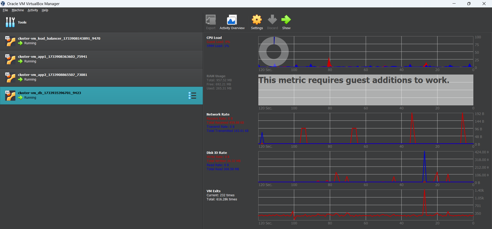

# Simulated Cluster Environment with Roles Using Vagrant and VirtualBox

## Project Overview:

This project builds on the previous multi-VM network setup to simulate a cluster environment with specific roles assigned to each virtual machine (VM). You'll create a load balancer, multiple application servers, and a database server to understand clustering, role-based architecture, and scalability.

By the end of this project, you will:

- Configure and provision a cluster with four VMs (load balancer, two app servers, and a database server).
- Set up internal communication between VMs using private networking.
- Enable load balancing and test application-to-database connectivity.

---

## Prerequisites:

1. System Requirements:

- 8 GB of RAM and multiple CPU cores on the host machine.
- Sufficient disk space for provisioning multiple VMs.

2. Installed Tools:
- VirtualBox: Hypervisor for running VMs.
- Vagrant: Tool to manage VM environments.

3. Basic Knowledge:
- Familiarity with Linux commands and Vagrant basics.


---
## Cluster Architecture
1. **Cluster Components**:
    - **Load Balancer**: Acts as the entry point, distributing traffic to application servers.
    - **Application Servers**: Serve application logic or static content.
    - **Database Server**: Stores and manages persistent data.

2. **IP Assignments**:
    - Load Balancer: `192.168.56.100`
    - App Server 1: `192.168.56.101`
    - App Server 2: `192.168.56.102`
    - Database Server: `192.168.56.110`

---

## Step-by-step Implementation

### Step 1: Initialize the Project

- **Create a Project Directory**:
   ```bash
   mkdir cluster-vm
   cd cluster-vm
   ```

- **Initialize the Vagrantfile**:
   ```bash
   vagrant init
   ```
   This creates a default `Vagrantfile` in the directory.

---

### **Step 2: Configure the Vagrantfile**

- Open the Vagrantfile in your text editor:
   ```bash
   vi Vagrantfile
   ```

- Replace the `Vagrantfile` content with the following configuration:
  
   ```ruby
   Vagrant.configure("2") do |config|
     # Load Balancer
     config.vm.define "load_balancer" do |lb|
       lb.vm.box = "bento/ubuntu-22.04"
       lb.vm.hostname = "load-balancer.local"
       lb.vm.network "private_network", ip: "192.168.56.100"
       lb.vm.provider "virtualbox" do |vb|
         vb.memory = "1024"
         vb.cpus = 1
       end
     end

     # Application Server 1
     config.vm.define "app1" do |app1|
       app1.vm.box = "bento/ubuntu-22.04"
       app1.vm.hostname = "app1.local"
       app1.vm.network "private_network", ip: "192.168.56.101"
       app1.vm.provider "virtualbox" do |vb|
         vb.memory = "1024"
         vb.cpus = 1
       end
     end

     # Application Server 2
     config.vm.define "app2" do |app2|
       app2.vm.box = "bento/ubuntu-22.04"
       app2.vm.hostname = "app2.local"
       app2.vm.network "private_network", ip: "192.168.56.102"
       app2.vm.provider "virtualbox" do |vb|
         vb.memory = "1024"
         vb.cpus = 1
       end
     end

     # Database Server
     config.vm.define "db" do |db|
       db.vm.box = "bento/ubuntu-22.04"
       db.vm.hostname = "db.local"
       db.vm.network "private_network", ip: "192.168.56.110"
       db.vm.provider "virtualbox" do |vb|
         vb.memory = "1024"
         vb.cpus = 1
       end
     end
   end
   ```

---

### **Step 3: Bring Up the Cluster**
- **Start the Cluster:**
   ```bash
   vagrant up
   ```

2. **Verify all VMs Are Running**:
   ```bash
   vagrant status
   ```
   You should see `load_balancer`, `app1`, `app2`, and `db` in the `running` state.

You can also view the status from the virtual box interface:



---

### **Step 4: Configure the Cluster Components**
#### **1. Load Balancer Configuration**
- SSH into the load balancer VM:
  ```bash
  vagrant ssh load_balancer
  ```
- Install Nginx:
  ```bash
  sudo apt update
  sudo apt install -y nginx
  ```
- Configure Nginx as a load balancer:

      ```bash
      sudo vi /etc/nginx/sites-available/default
      ```
- Replace the content with:
      
      ```nginx
      upstream app_cluster {
          server 192.168.56.101;
          server 192.168.56.102;
      }
  
      server {
          listen 80;
          location / {
              proxy_pass http://app_cluster;
          }
      }
      ```
- Restart Nginx:
      
      ```bash
      sudo systemctl restart nginx
      ```

#### **2. Application Servers Configuration**

Repeat these steps for both `app1` and `app2`:

- SSH into the app server:
      
      ```bash
      vagrant ssh app1  # or vagrant ssh app2
      ```
- Install a web server:
      
      ```bash
      sudo apt update
      sudo apt install -y apache2
      ```

- Create a simple HTML page to differentiate servers:
      
      ```bash
      echo "Welcome to App Server 1" | sudo tee /var/www/html/index.html
      ```
**Note: (For app2, modify the message to "Welcome to App Server 2".)**
    
- Restart Apache:
      
      ```bash
      sudo systemctl restart apache2
      ```

#### **3. Database Server Configuration**

- SSH into the database server:
  
  ```bash
  vagrant ssh db
  ```
- Install MySQL:
  
  ```bash
  sudo apt update
  sudo apt install -y mysql-server
  ```
Allow connections from app servers:
    
- Edit the MySQL configuration file:
      
      ```bash
      sudo vi /etc/mysql/mysql.conf.d/mysqld.cnf
      ```

- Bind MySQL to all interfaces:
      
      ```bash
      bind-address = 0.0.0.0
      ```
- Restart MySQL:
      
      ```bash
      sudo systemctl restart mysql
      ```
- Create a database and user:
      
      ```bash
      sudo mysql -u root -e "
      CREATE DATABASE clusterdb;
      CREATE USER 'clusteruser'@'%' IDENTIFIED BY 'password';
      GRANT ALL PRIVILEGES ON clusterdb.* TO 'clusteruser'@'%';
      FLUSH PRIVILEGES;"
      ```

---

### **Step 5: Test the Cluster**

1. **Test Load Balancer**:
    
- Access the load balancer from your host machine’s browser:
     
      ```
      http://192.168.56.100
      ```
**Refresh the page to see traffic alternating between app servers.**

LOADBALANCER

---

APP1


---

APP2


---

2. **Test Application-to-Database Communication**:
    
- SSH into an app server (e.g., `app1`):
      
      ```bash
      vagrant ssh app1
      ```

- Install MySQL client:
      
      ```bash
      sudo apt install -y mysql-client
      ```

- Connect to the database server:
      
      ```bash
      mysql -h 192.168.56.110 -u clusteruser -p
      ```
      (Use `password` as the password.)

---

### **Step 6: Scale the Cluster (Optional)**

1. **Add Additional App Servers:**

- Duplicate the `app2` block in the `Vagrantfile` and update the name, hostname, and IP.

- Re-provision:
      
      ```bash
      vagrant reload --provision
      ```

---

## Wrapping Up

This project so far reflects the core principles of modern infrastructure: iterative improvement, resource efficiency, and seamless orchestration. From single VM setups to robust cluster simulations, you’ve gained hands-on experience with concepts foundational to DevOps, cloud computing, and system scalability. As you move forward, these skills set the stage for exploring advanced technologies like Docker, Kubernetes, and cloud-based architectures, empowering you to design, deploy, and optimize production-grade systems with confidence. Bravo!🚀

### Cleanup:

- To free up resources, destroy all VMs:

      ```bash
      vagrant destroy -f
      ```


**Project Completed! 🚀**
